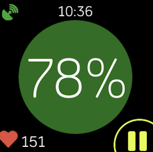

# KtHR
Exercise monitor for fitbit sdk that incorporates heart rate zones from myzone app

{width=30%}

This Fitbit application was created to help track heart rate zones during exercise. You can select from 6 different exercise types to begin and your steps, mileage, heart rate, calories, and time will be recorded in the fitbit app upon completion of the exercise. 

{width=30%}

### Installing:

* **Versa 2** - follow this [link](https://gallery.fitbit.com/details/0a69fd7d-1bbf-4eef-9a19-b873be43eee8) on your phone to install the KtHR Fitbit app
* **Versa 3** - follow this [link](https://gallery.fitbit.com/details/241d89f5-c673-4386-82d0-7a3f39155ea1) on your phone to install the KtHR Fitbit app
